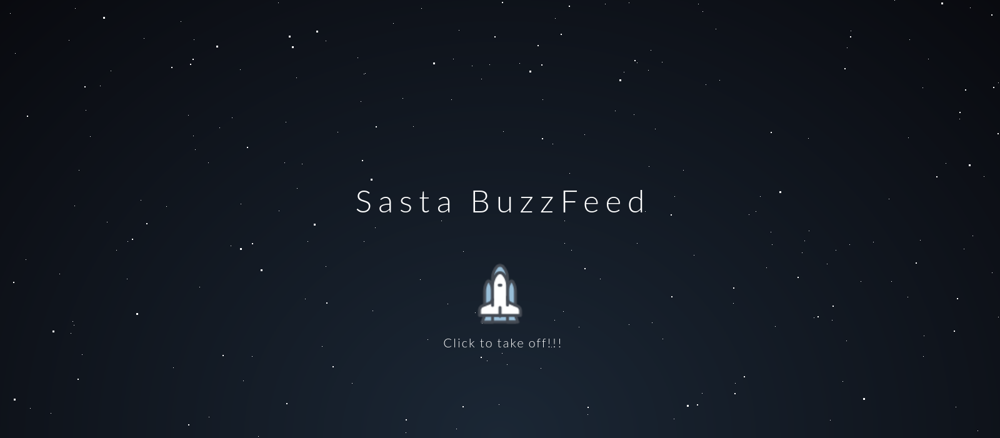
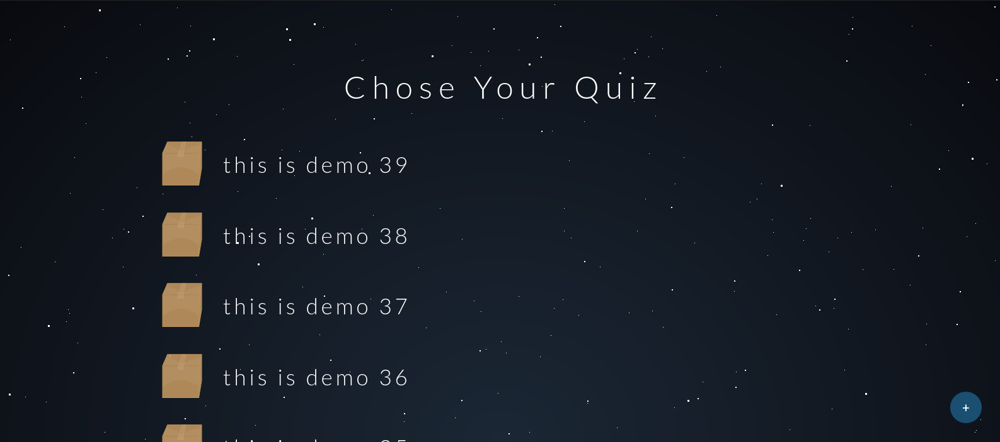
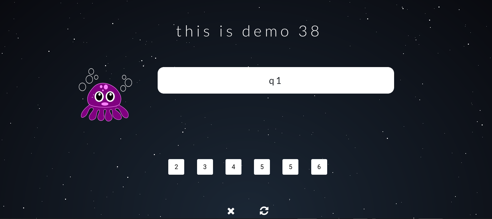
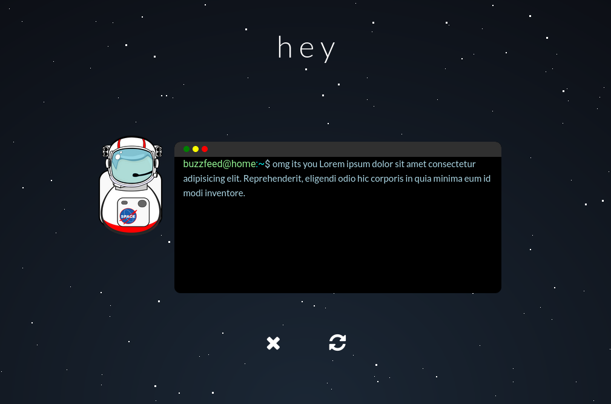
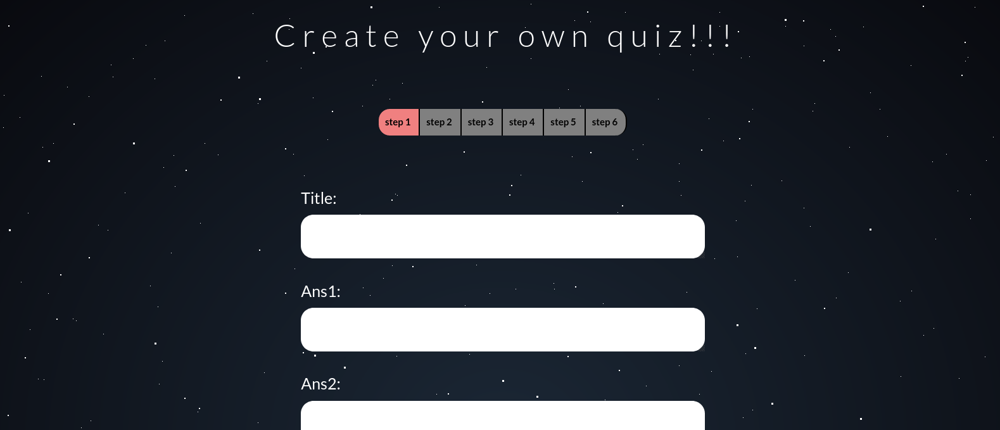

<h1 align="center">Sasta BuzzFeed :rocket:</h1>
<div align="center">
  <br>
  <h3> A Quizz app like BuzzFeed made using Django</h3>
</div>

---

-Snapshots of the project :


  
  

  


  
### To run this project :

Clone the project -
```
  $ git clone https://github.com/mrpandya/Sasta-Buzzfeed.git
```
  
Go to the project -
```
  $ cd Sasta-Buzzfeed
 ``` 
Install all the reqirements -
```
  $ pip install --requirements.txt
 ``` 
Run the following commands -

 for linux/mac :
``` 
  $ python manage.py migrate
  $ python manage.py makemigrations
``` 
 for windows :
 ``` 
  $ py manage.py migrate
  $ py manage.py makemigrations
 ``` 
Start the project -

 for linux/mac :
```
  $ python manage.py runserver
```  
 for windows :
``` 
  $ py manage.py runserver
```

 #### This project still has scope of development, so you can also contribute to this Project as follows:
* [Fork](https://github.com/mrpandya/Sasta-Buzzfeed) this Repository.
* Clone your Fork on a different branch:
	* `git clone -b <name-of-branch> https://github.com/mrpandya/Sasta-Buzzfeed.git`
* After adding any feature:
	* Goto your fork and create a pull request.
	* Your modifications will be  tested and the changes will be merged.

---
<h3 align="center"><b>Developed with :heart: by <a href="https://github.com/mrpandya">Manan Pandya</a> .</b></h1>
